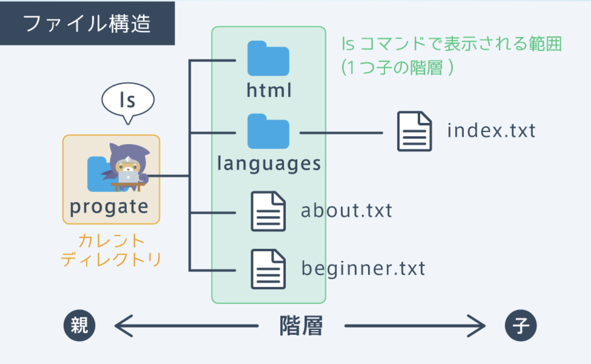

## コマンドラインとは
・文字だけでコンピュータを操作するためのもの<br>
・サイトやアプリなどの開発をする上で必須のツール<br>
・UNIXコマンドは主にLinuxやmacOSで利用されるコマンドの一種

コマンド（命令）・・・
ターミナルと呼ばれるものにコマンド（命令）を入力することで、コンピュータに指示を与えることができる

### ① ファイルの作成
「touch ファイル名」と入力して実行することで、空のファイルを作成することができる

```rb
$ touch ファイル名
```

### ② ファイルの中身を表示する
コマンドでファイルの中身を表示することができる<br>
catコマンドは「cat ファイル名」と入力することで使うことができる<br>
※concatenate” （連結させる）

```rb
$ cat ファイル名
```
<details><summary>コマンドラインの補完機能</summary>

・ファイル名やフォルダ名を入力するときにファイル名の入力途中にTabキーを押すことで、残りのファイル名を補完してくれる機能<br>
👉効率が良くなるだけでなく、先程のような存在しないファイル名によるエラーなどを防ぎやすくなる
</details>

### ③ ディレクトリを作成する
・コマンドを用いて、新たにフォルダを作成することもできる。また、コマンドラインではフォルダをディレクトリと呼ぶので、覚えておく<br>
・ディレクトリを作成するには、mkdirコマンドを使う<br>→mkdirコマンドは「mkdir ディレクトリ名」と入力することで使うことができる

```rb
$ mkdir ディレクトリ名
```

### ④ ディレクトリの移動
・ディレクトリを移動するためにはcdコマンドを使う<br>
・「cd ディレクトリ名」とすることで、指定したディレクトリに移動することができる
※change directory

```rb
$ cd ディレクトリ名
```

<details><summary>カレントディレクトリの表示</summary>
「$」の左にはカレントディレクトリが表示されている

```rb
~ $ cd html
html $
```

ルートディレクトリ・・・ファイル構造には、1番親のディレクトリにルートディレクトリというものがある。ルートディレクトリは「/」で表される
</details>

### ➄ 現在いるカレントディレクトリを確認する
・作業中のディレクトリを確認できるpwdコマンド<br>
・pwdコマンドを実行すると、ルートディレクトリからカレントディレクトリまでの階層が全て表示される

```rb
$ pwd
```

### ⑥ ファイル・ディレクトリの中身を一覧で表示する
・カレントディレクトリを確認することはできたが、ディレクトリを移動するときなどには、ディレクトリの中身を見れた方が便利<br>
・ディレクトリの中身を確認するには、ls（エルエス）コマンドを使う<br>
・lsコマンドで表示される範囲（一つ子の階層のみ）

```rb
$ ls
about.txt beginner.txt html languages
```

↓ ファイルの詳細を表示する

```rb
$ ls -l
```



### ⑦ 1つ親のディレクトリに移動

・1つ親のディレクトリに移動するときに「cd 1つ親のディレクトリ名」としても移動することができない<br>
・コマンドラインでは、1つ親のディレクトリを「..」で指定する<br>→1つ親のディレクトリに移動したい場合のコマンドは「cd ..」となる

```rb
html $ cd ..
```

### ⑧ ホームディレクトリに移動
・cdコマンドでは、ディレクトリを指定せずに「cd」のみで実行すると、ホームディレクトリと呼ばれるディレクトリに移動することができる<br>
・ホームディレクトリは、下の図のように「~」で表される<br>

ホームディレクトリ・・・ユーザーが作業をするときに起点にするディレクトリのこと

```rb
languages $ cd
~ $ pwd
```